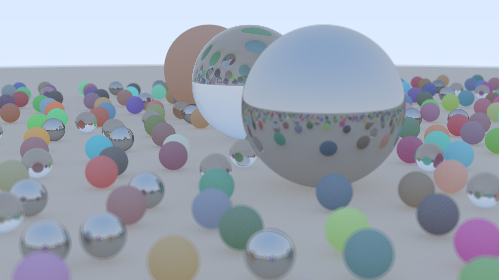

# A simple ray tracer in Odin based on *Ray Tracing in One Weekend*



## Building

The image above can be produced with the command
    ```
    odin run . -o:speed
    ```
called within a local copy of this repository. (The image produced will be of lower resolution than that above though; resolution parameters can be adjusted in ``main.odin``.) No makefiles or package managers are required for compilation &mdash; the Odin compiler and source code are enough.

By default, the ray-tracer will write the rendered image to ``image.ppm``. Any decent image viewer is able to open ``.ppm`` files. The PPM image format does not utilize compression however, so ``.ppm`` files are much larger than they need to be. There exist free command-line utilities which easily convert ``.ppm`` files to common image formats utilizing compression. (For example, the ImageMagick command ``magick image.ppm image.jpg`` converts the output of the render to a JPEG file.)

## Similarities to *Ray Tracing in One Weekend* by Shirley et. al.

This ray-tracer was made by (loosely) following the guide in [Ray Tracer in One Weekend](https://raytracing.github.io/books/RayTracingInOneWeekend.html) by Peter Shirley et al. Most of our design decisions are similar, but it is not a clone of Shirley's. Shirley implemented a ray-tracer in C++, but we used [Odin](https://odin-lang.org) instead. Odin is a systems-level programming language which is an alternative to C. Unlike C++, fixed-length vector data types and operations are part of the core Odin language, so huge swaths of C++ code in Shirley's implementation were unnecessary and hence skipped (like the vector classes in 3.1 and 3.2).

## Optimizations

This ray-tracer is simple and does NOT utilize multithreading or bounded volume hierarchies (both of which would significantly speed up computation). As such, on an Intel i5-1135, the default render as specified above takes about 11 seconds. A 1920 x 1080 render with over 500 samples, used to create the image above, took roughly 16 * 100 * 11 secs = 5 hours.

Nevertheless, the code contains some 64-bit x86 assembly optimizations to make debug builds faster, contained in ``xmm-procs.s``. The optimizations are OFF by default, and are controlled by the compile-time ``ASSEMBLY_OPTIMIZATIONS`` variable in ``main.odin``. The optimizations were created for an CPU with 64-bit x86 architecture, so they may not work on other CPU architectures. (We have not tested it on other architectures.) It is NOT recommended to use the assembly procedures when compiling the ray tracer with the ``-o:speed`` flag, since in practice the compiled code is approximately 10% faster with the assembly procedures OFF.

We used data types of fixed-length arrays of four 32-bit floats throughout the code as this allows LLVM to compile the code with efficient SIMD instructions. We found that in practice it was faster to use an array of vectors of type [4] f32 with the last float zeroed than using an array of vectors of type [3] f32.)
